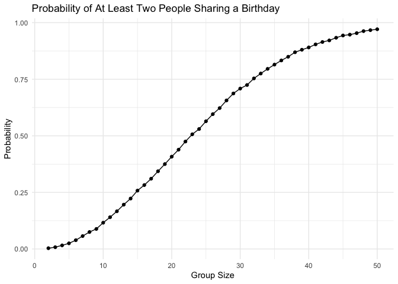
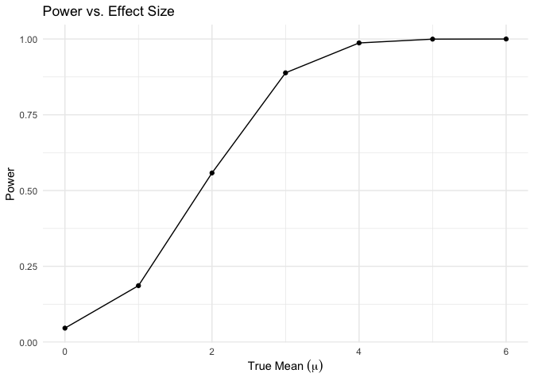
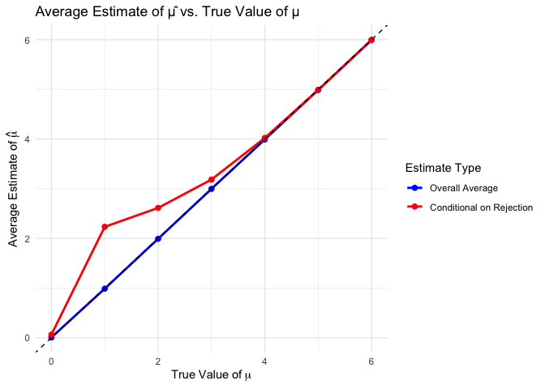
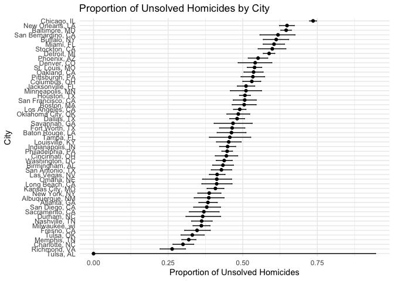

hw5
================
Shike Zhang
2024-11-15

``` r
library(tidyverse)
```

    ## ── Attaching core tidyverse packages ──────────────────────── tidyverse 2.0.0 ──
    ## ✔ dplyr     1.1.4     ✔ readr     2.1.5
    ## ✔ forcats   1.0.0     ✔ stringr   1.5.1
    ## ✔ ggplot2   3.5.1     ✔ tibble    3.2.1
    ## ✔ lubridate 1.9.3     ✔ tidyr     1.3.1
    ## ✔ purrr     1.0.2     
    ## ── Conflicts ────────────────────────────────────────── tidyverse_conflicts() ──
    ## ✖ dplyr::filter() masks stats::filter()
    ## ✖ dplyr::lag()    masks stats::lag()
    ## ℹ Use the conflicted package (<http://conflicted.r-lib.org/>) to force all conflicts to become errors

``` r
library(rvest)
```

    ## 
    ## Attaching package: 'rvest'
    ## 
    ## The following object is masked from 'package:readr':
    ## 
    ##     guess_encoding

## Problem 1

``` r
simulate_shared_birthday <- function(n) {
  # Generate random birthdays for 'n' people
  birthdays <- sample(1:365, n, replace = TRUE)
  # Check if there are any duplicate birthdays
  return(any(duplicated(birthdays)))
}
```

``` r
set.seed(123)  # Set seed for reproducibility

# Define the range of group sizes
group_sizes <- 2:50

# Initialize a vector to store the probabilities
probabilities <- numeric(length(group_sizes))

# Loop through each group size, run the simulation 10,000 times, and calculate the probability
for (i in seq_along(group_sizes)) {
  n <- group_sizes[i]
  # Run the simulation 10,000 times and calculate the mean of the results
  results <- replicate(10000, simulate_shared_birthday(n))
  probabilities[i] <- mean(results)
}

# Create a data frame with group sizes and their corresponding probabilities for plotting
birthday_prob_data <- data.frame(GroupSize = group_sizes, Probability = probabilities)
```

``` r
library(ggplot2)

# Plotting the probability of shared birthdays as a function of group size
ggplot(birthday_prob_data, aes(x = GroupSize, y = Probability)) +
  geom_line() +
  geom_point() +
  labs(
    title = "Probability of At Least Two People Sharing a Birthday",
    x = "Group Size",
    y = "Probability"
  ) +
  theme_minimal()
```

<!-- -->

simulate_shared_birthday: This function generates random birthdays for a
group of size n and checks if any two birthdays are the same.

Simulation Loop: We simulate 10,000 trials for each group size from 2 to
50, calculating the probability by averaging the results.

Plotting: The plot shows the increasing probability of shared birthdays
as the group size increases, visualizing the classic “birthday problem.”

The plot reveal that as the group size increases, the probability of at
least two people sharing a birthday rapidly increases, illustrating the
“birthday paradox.” Even with a relatively small group size , there’s
already a high probability of a shared birthday. This counterintuitive
result arises because the number of potential birthday pairs grows
quickly as the group size increases.

## Problem 2

``` r
library(dplyr)
library(broom)
library(ggplot2)
# Set simulation parameters
n <- 30
sigma <- 5
mu_values <- 0:6
num_simulations <- 5000
alpha <- 0.05

# Initialize data frame to store results
results <- data.frame()

# Loop through each true mean value and perform simulations
for (mu in mu_values) {
  # Generate datasets and perform t-tests
  sim_data <- replicate(num_simulations, {
    x <- rnorm(n, mean = mu, sd = sigma)  # Simulate dataset
    t_test <- t.test(x, mu = 0)  # Perform one-sample t-test
    tidy_t_test <- tidy(t_test)  # Extract p-value and statistics
    data.frame(
      mu_true = mu,
      mu_hat = mean(x),  # Sample mean
      p_value = tidy_t_test$p.value  # P-value
    )
  }, simplify = FALSE)
  
  # Combine simulation results into one data frame
  sim_results <- bind_rows(sim_data)
  # Add to the overall results
  results <- bind_rows(results, sim_results)
}

# Group by true mean and calculate power
power_results <- results %>%
  group_by(mu_true) %>%
  summarize(power = mean(p_value < alpha))  # Proportion of rejections


# Create the Power vs. Effect Size plot
ggplot(power_results, aes(x = mu_true, y = power)) +
  geom_line() +
  geom_point() +
  labs(
    title = "Power vs. Effect Size",
    x = expression(True~Mean~(mu)),
    y = "Power"
  ) +
  theme_minimal()
```

<!-- --> The plot
demonstrates the typical behavior in hypothesis testing: as the true
effect size (μ) increases, the ability to detect the effect increases.
The plot also shows that for small effect sizes (μ≈0), the test may fail
to reject the null hypothesis, highlighting the importance of having a
sufficiently large effect to detect in statistical tests.

``` r
# Calculate the overall average estimate of mu_hat for each mu_true
overall_avg <- results %>%
  group_by(mu_true) %>%
  summarize(avg_mu_hat = mean(mu_hat), .groups = "drop")

# Calculate the average estimate of mu_hat for samples where the null was rejected
conditional_avg <- results %>%
  filter(p_value < alpha) %>%
  group_by(mu_true) %>%
  summarize(avg_mu_hat_rejected = mean(mu_hat), .groups = "drop")

# Merge the two summaries into a single data frame
avg_estimates <- overall_avg %>%
  left_join(conditional_avg, by = "mu_true")


# Reshape the data to a long format for ggplot
avg_estimates_long <- avg_estimates %>%
  pivot_longer(
    cols = c(avg_mu_hat, avg_mu_hat_rejected),
    names_to = "Estimate_Type",
    values_to = "Average_mu_hat"
  )


# Create the plot
ggplot(avg_estimates_long, aes(x = mu_true, y = Average_mu_hat, color = Estimate_Type)) +
  geom_line(size = 1) +
  geom_point(size = 2) +
  labs(
    title = "Average Estimate of μ̂ vs. True Value of μ",
    x = expression(True~Value~of~mu),
    y = expression(Average~Estimate~of~hat(mu)),
    color = "Estimate Type"
  ) +
  scale_color_manual(
    values = c("blue", "red"),
    labels = c("Overall Average", "Conditional on Rejection")
  ) +
  geom_abline(slope = 1, intercept = 0, linetype = "dashed", color = "black") +
  theme_minimal()
```

    ## Warning: Using `size` aesthetic for lines was deprecated in ggplot2 3.4.0.
    ## ℹ Please use `linewidth` instead.
    ## This warning is displayed once every 8 hours.
    ## Call `lifecycle::last_lifecycle_warnings()` to see where this warning was
    ## generated.

<!-- --> Why does the
conditional average differ from the true value for small μ?

The null hypothesis is rejected primarily in cases where estimated μ
happens to deviate significantly from 0. This creates a selection bias,
where only unusually high or low sample means (depending on the
direction of the deviation) are included in the conditional average.

For small true means (μ≈0), this selection bias skews the conditional
average upward.

Why does the conditional average converge to the true value as μ
increases?

For larger true means, most tests reject the null hypothesis, so the
conditional average includes nearly all samples. This reduces the
selection bias, and the conditional average better reflects the true
mean.

Blue Line (Overall Average):

The overall average estimate of ^μ closely follows the dashed y=x line.

This indicates that estimated ^μ is an unbiased estimator of μ when
considering all simulations, regardless of the test outcome.

Even at μ=0, the overall average of estimated ^μ is approximately 0,
reflecting no systematic bias.

Red Line (Conditional on Rejection):

For small true values of μ,0 or 1,the red line is notably higher than
the dashed line. This indicates that the conditional average is biased
upward in cases where the null hypothesis is rejected.

As the true value of μ increases, the red line converges toward the
dashed line and aligns more closely with the blue line. This is because
larger true values of μ make rejecting the null hypothesis more likely,
reducing the bias introduced by selection.

## Problem 3

``` r
library(dplyr)
library(broom)
library(purrr)
library(ggplot2)

# Load the data
homicide_data <- read.csv("~/Desktop/DS HW/p8105_hw5_sz3318/homicide-data.csv")  # Replace with the actual data path

# Inspect the data structure
glimpse(homicide_data)
```

    ## Rows: 52,179
    ## Columns: 12
    ## $ uid           <chr> "Alb-000001", "Alb-000002", "Alb-000003", "Alb-000004", …
    ## $ reported_date <int> 20100504, 20100216, 20100601, 20100101, 20100102, 201001…
    ## $ victim_last   <chr> "GARCIA", "MONTOYA", "SATTERFIELD", "MENDIOLA", "MULA", …
    ## $ victim_first  <chr> "JUAN", "CAMERON", "VIVIANA", "CARLOS", "VIVIAN", "GERAL…
    ## $ victim_race   <chr> "Hispanic", "Hispanic", "White", "Hispanic", "White", "W…
    ## $ victim_age    <chr> "78", "17", "15", "32", "72", "91", "52", "52", "56", "4…
    ## $ victim_sex    <chr> "Male", "Male", "Female", "Male", "Female", "Female", "M…
    ## $ city          <chr> "Albuquerque", "Albuquerque", "Albuquerque", "Albuquerqu…
    ## $ state         <chr> "NM", "NM", "NM", "NM", "NM", "NM", "NM", "NM", "NM", "N…
    ## $ lat           <dbl> 35.09579, 35.05681, 35.08609, 35.07849, 35.13036, 35.151…
    ## $ lon           <dbl> -106.5386, -106.7153, -106.6956, -106.5561, -106.5810, -…
    ## $ disposition   <chr> "Closed without arrest", "Closed by arrest", "Closed wit…

The dataset is used to summarize the number of homicides and identify
the number of unsolved homicides for each city.The raw data appears to
include information on homicides across 50 large U.S. cities. The
resolution of a homicide case is determined based on the “disposition”
column. Cases with dispositions “Closed without arrest” or “Open/No
arrest” are classified as unsolved.

``` r
# Create city_state variable and summarize homicides
homicide_summary <- homicide_data %>%
  mutate(city_state = paste(city, state, sep = ", ")) %>%
  group_by(city_state) %>%
  summarize(
    total_homicides = n(),
    unsolved_homicides = sum(disposition %in% c("Closed without arrest", "Open/No arrest"))
  )
```

``` r
# estimate Proportion of Unsolved Homicides for Baltimore, MD
# Filter for Baltimore, MD
baltimore_data <- filter(homicide_summary, city_state == "Baltimore, MD")

# Perform prop.test for Baltimore
baltimore_test <- prop.test(
  x = baltimore_data$unsolved_homicides,
  n = baltimore_data$total_homicides
)

# Tidy the result to get estimate and confidence interval
baltimore_result <- tidy(baltimore_test)
baltimore_result
```

    ## # A tibble: 1 × 8
    ##   estimate statistic  p.value parameter conf.low conf.high method    alternative
    ##      <dbl>     <dbl>    <dbl>     <int>    <dbl>     <dbl> <chr>     <chr>      
    ## 1    0.646      239. 6.46e-54         1    0.628     0.663 1-sample… two.sided

``` r
# Run prop.test for each city
city_tests <- homicide_summary %>%
  mutate(
    test_result = map2(unsolved_homicides, total_homicides, ~ prop.test(.x, .y)),
    tidy_result = map(test_result, tidy)
  ) %>%
  unnest(tidy_result) %>%
  select(city_state, estimate, conf.low, conf.high)
```

    ## Warning: There was 1 warning in `mutate()`.
    ## ℹ In argument: `test_result = map2(unsolved_homicides, total_homicides,
    ##   ~prop.test(.x, .y))`.
    ## Caused by warning in `prop.test()`:
    ## ! Chi-squared approximation may be incorrect

``` r
# Plotting estimates and CIs
ggplot(city_tests, aes(x = reorder(city_state, estimate), y = estimate)) +
  geom_point() +
  geom_errorbar(aes(ymin = conf.low, ymax = conf.high), width = 0.2) +
  labs(
    title = "Proportion of Unsolved Homicides by City",
    x = "City",
    y = "Proportion of Unsolved Homicides"
  ) +
  theme_minimal() +
  coord_flip()
```

<!-- --> This plot
effectively demonstrates the disparity in the resolution of homicide
cases across major U.S. cities. It can inform policymakers and law
enforcement agencies about which cities may need additional support or
investigation into why their unsolved homicide rates are higher. The
inclusion of confidence intervals provides important context about the
reliability of the estimates.Cities like Richmond, VA and Charlotte, NC
have very low proportions of unsolved homicides. Cities like Chicago, IL
and New Orleans, LA have much higher proportions of unsolved homicides,
with some estimates nearing 0.75.
